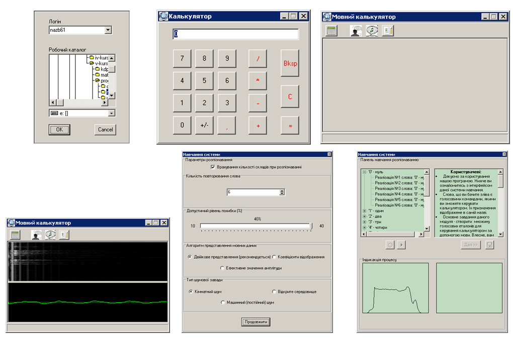

# Speech_recognition_calculator
A simple calculator developed in Borland C++ Builder 6, which recognizes speech commands.

Один із моїх старіших проектів. Спектроаналізатор взято із роботи автора Москаленко О.М. Математичний апарат реалізовано на основі праць Вінцюк Т.К. з деякими модифікаціями. Синтез (озвучення) команд реалізовано на основі Microsoft Speech API COM інтерфейсу. 

У роботі вирішена задача обробки вхідних звукових (мовних) даних і їх розпізнавання програмними засобами. Для цього написано програму, що реалізована в середовищі програмування С++ Builder 6.0. На виході програма дозволяє ідентифікувати “сказане” слово або ж виявити наближене до нього. Розпізнані слова є командами мовного калькулятора. Тобто прикладне застосування даної роботи – це робота з калькулятором за допомогою голосу.

Для отримання звукових даних програма вибирає аудіопристрій який відповідає наступним характеристикам WAVE_PCM 11025Hz 16bit mono, з підтримкою мультибуферизації. Частота дискретизації 11025Гц зумолена тим, що основне енергетичне навантаження в мові людини припадає на діапазон до 3000Гц. Для роботи зі звуком використано бібліотеку mmsystem. 

Подальша робота включає: розпізнавання – метод КДП (Композиційне динамічне програмування), для виявлення приналежності мовних даних до певного еталону. За міру східності сигналів було обрано відстань Хеммінга і\або Евклідову відстань. Вхідні сигали представлено значеннями ефективних амплітуд або коефіцієнтами відображення (за алгоритмом Дурбіна).

Метод КДП базується на економному представленні множин еталонних сигналів класів з допомогою автоматних породжуючих граматик, синтезуючих еталонні сигнали з елементарних частин, які представляють фонеми чи їх фази. Порівняння ж досліджуваного мовного сигналу з  еталонним і пошук найбільш правдоподібного еталонного сигналу здійснюється за допомогою процедур динамічного програмування. КДП-підхід реалізує розпізнавання мовних сигналів шляхом напрямленого синтезу еталонних сигналів мови. При цьому враховуються такі явища як коартикуляція і редукція, нелінійна зміна темпу та інтенсивність вимови також індивідуальні особливості голосу.  

В даній роботі використовувася цифровий фільтр Баттерворта. Для виділення огинаючої, випрямлений сигнал проходив через фільтр нижніх частот зі смугою пропускання 50 Гц. Цей сигнал потрібний для ілюстрації процесу навчання та для виділення складів. Для підрахунку кількості складів, огинаюча сигналу проходила ще через два фільтри: нижніх частот зі смугою пропускання 300 Гц; та верхніх частот зі смугою затримки 300 Гц. 
